# 🌱 CultivationX

**AI-Powered Developer Career Growth Platform**

CultivationX helps developers analyze resumes, identify skill gaps, track coding progress (GitHub + LeetCode), push LeetCode solutions to GitHub with AI review and auto-generated README, and get AI-powered mentorship — all in one dashboard.

---

## Features

| Module | Description |
|--------|-------------|
| **Rise** | AI resume parser + ATS score + skill gap analysis |
| **DevDNA** | AI-powered developer personality & growth report |
| **Nexus** | GitHub OAuth sync & LeetCode stats tracking |
| **Mentor** | AI coding mentor with code review |
| **LeetGit+** | Submit LeetCode solutions → AI review → auto-push to GitHub |
| **Dashboard** | Unified progress tracking across all modules |

---

## Tech Stack

**Backend**
- Java 21 + Spring Boot 3.5
- Spring AI (Groq API)
- Spring Security + JWT Authentication
- Spring Data JPA + MySQL
- Apache Tika (PDF/DOCX parsing)

**Frontend**
- React 18 + TypeScript
- Vite

**DevOps**
- Docker + Docker Compose
- Nginx (reverse proxy)

---

## Quick Start

### Prerequisites

- Java 21
- Maven 3.9+
- Node.js 18+
- MySQL 8.0

### Project Structure
```
CultivationX/
├── backend/
│   ├── src/main/java/com/cultivationx/
│   │   ├── auth/
│   │   ├── rise/
│   │   ├── mentor/
│   │   ├── nexus/
│   │   ├── devdna/
│   │   └── ai/
│   ├── src/main/resources/
│   │   ├── application.yml
│   │   └── application-example.yml
│   ├── .env
│   └── pom.xml
├── frontend/
│   ├── src/
│   │   ├── components/
│   │   ├── pages/
│   │   ├── api/
│   │   └── types/
│   ├── public/
│   ├── package.json
│   └── vite.config.ts
├── docker-compose.yml
└── README.md
```

### 1. Clone

```bash
git clone https://github.com/aadityahammad-2002/CultivationX.git
cd CultivationX
```

### 2. Setup Environment

```bash
cp backend/.env.example backend/.env
```

Edit `backend/.env` with your keys:

```properties
GROQ_API_KEY=your-groq-api-key
GITHUB_CLIENT_ID=your-github-client-id
GITHUB_CLIENT_SECRET=your-github-client-secret
JWT_SECRET=your-secret-min-32-chars
```

### 3. Start MySQL

```bash
docker run -d \
  --name mysql \
  -e MYSQL_ROOT_PASSWORD=root \
  -p 3306:3306 \
  mysql:8
```

### 4. Run Backend

```bash
cd backend
mvn clean spring-boot:run
```

API: `http://localhost:8080/api`

### 5. Run Frontend

```bash
cd frontend
npm install
npm run dev
```

App: `http://localhost:5173`

---

## Docker Setup

```bash
docker-compose up --build
```

---

## API Keys Setup

**Groq**
- Sign up at [console.groq.com](https://console.groq.com)
- Create API key

**GitHub OAuth**
- Settings → Developer settings → OAuth Apps → New OAuth App
- Callback URL: `http://localhost:8080/api/auth/github/callback`

---

## Screenshots

<p align="center">
  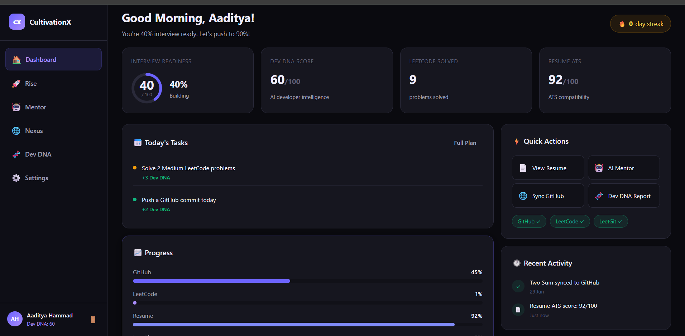
  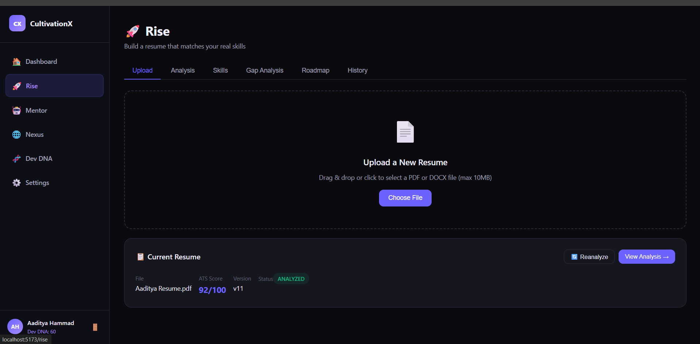
  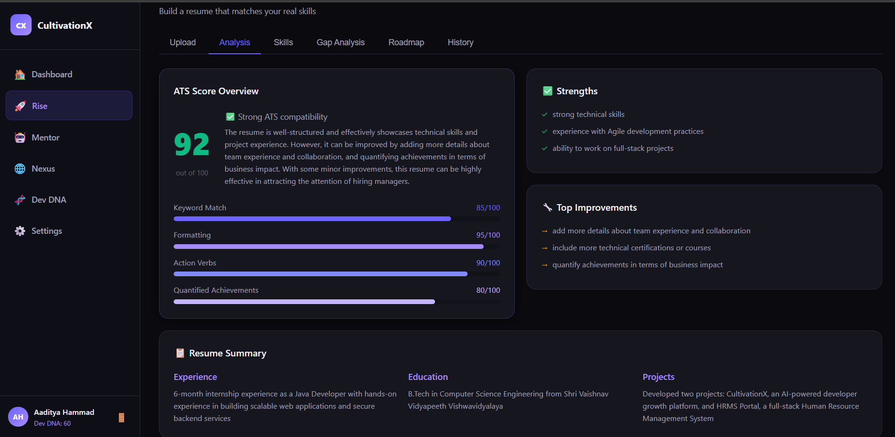
</p>

<p align="center">
  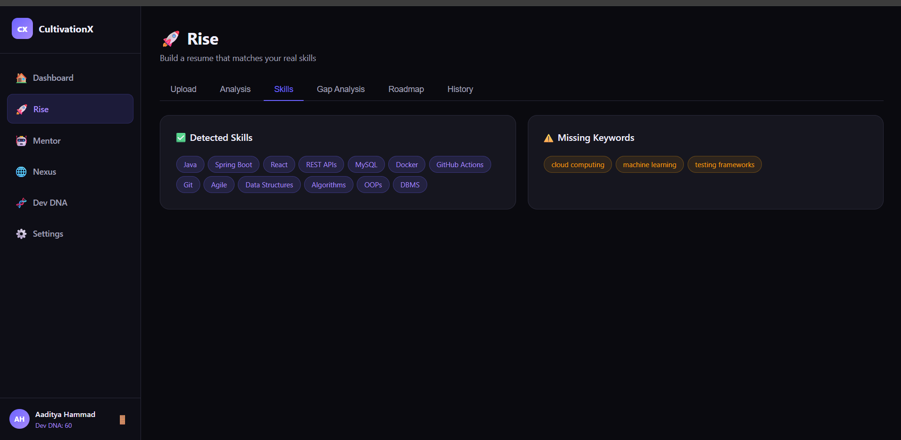
  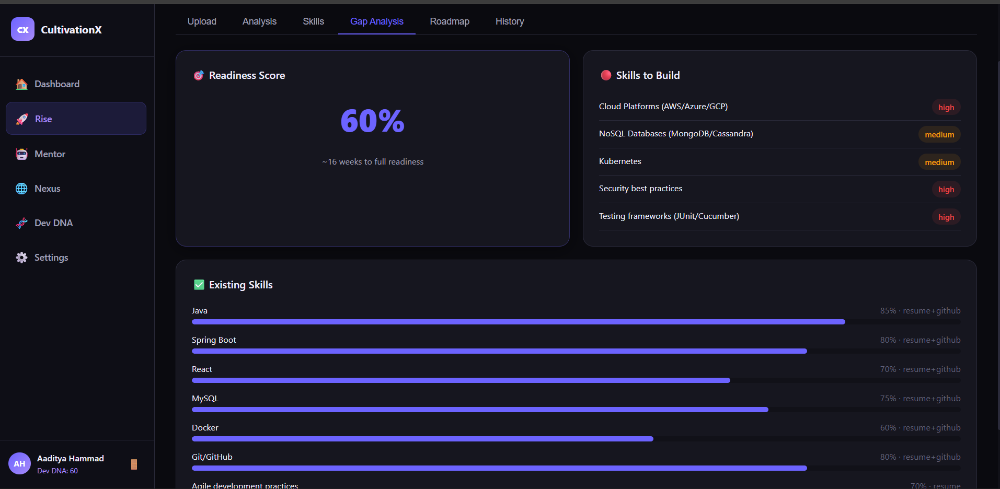
  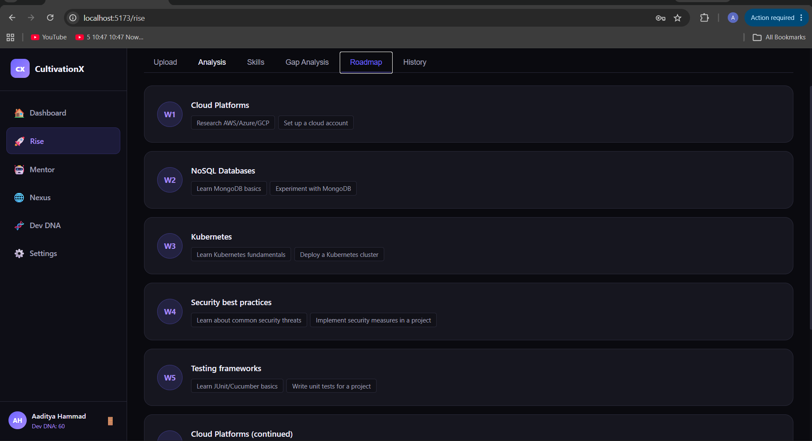
</p>

<p align="center">
  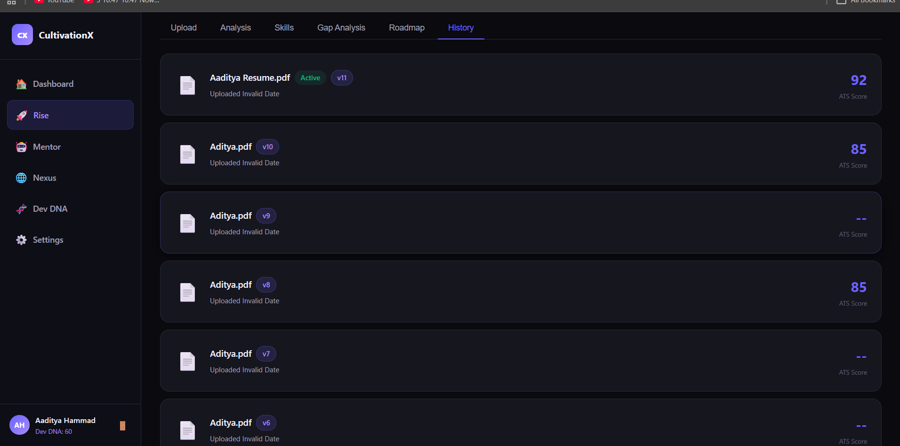
  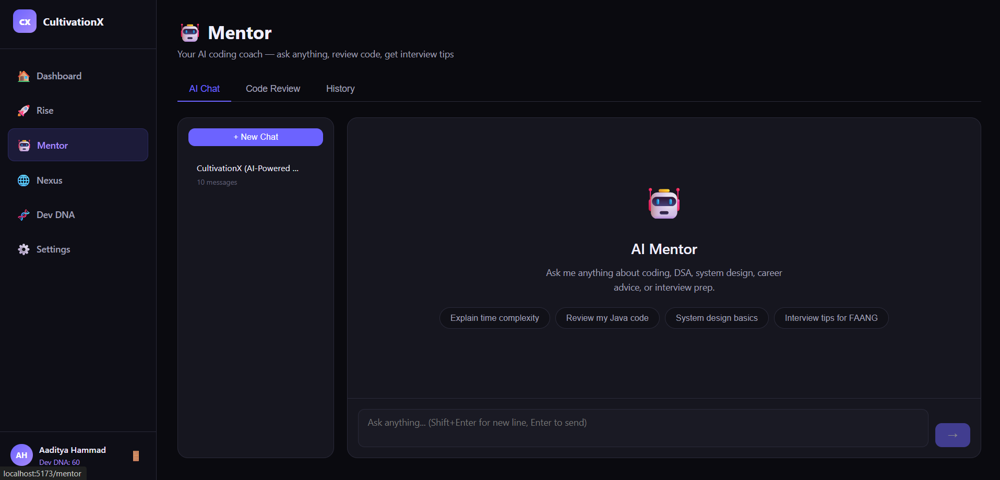
  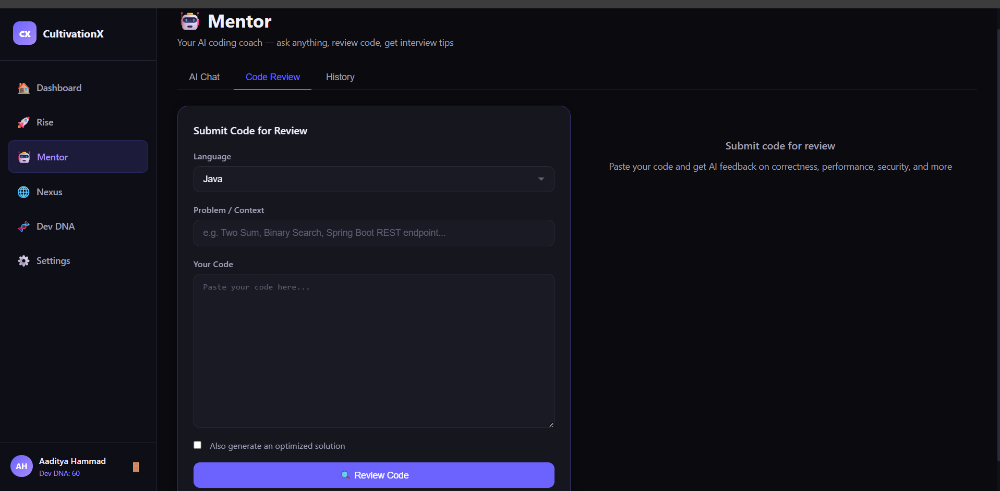
</p>

<p align="center">
  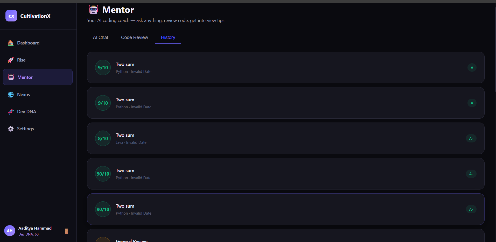
  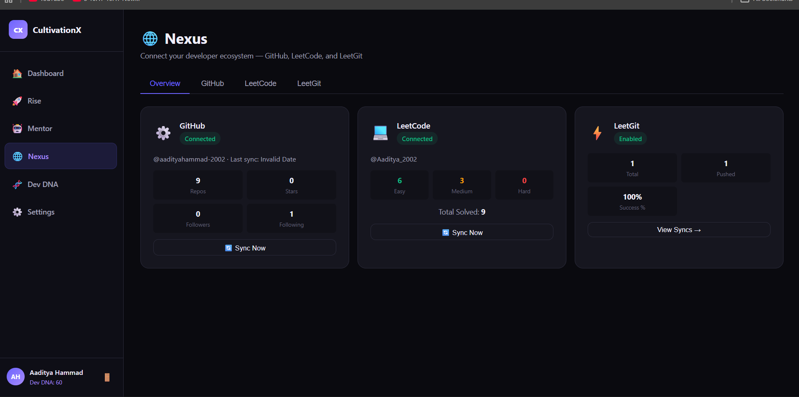
  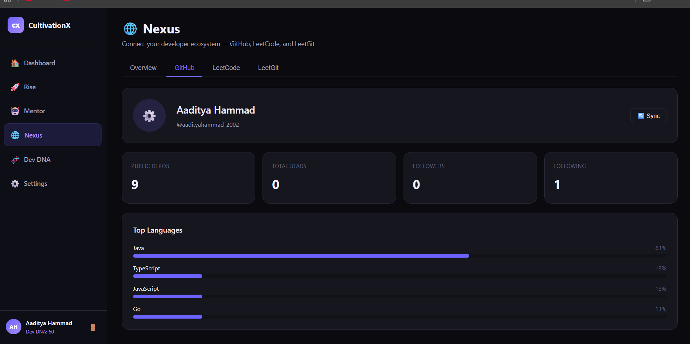
</p>

<p align="center">
  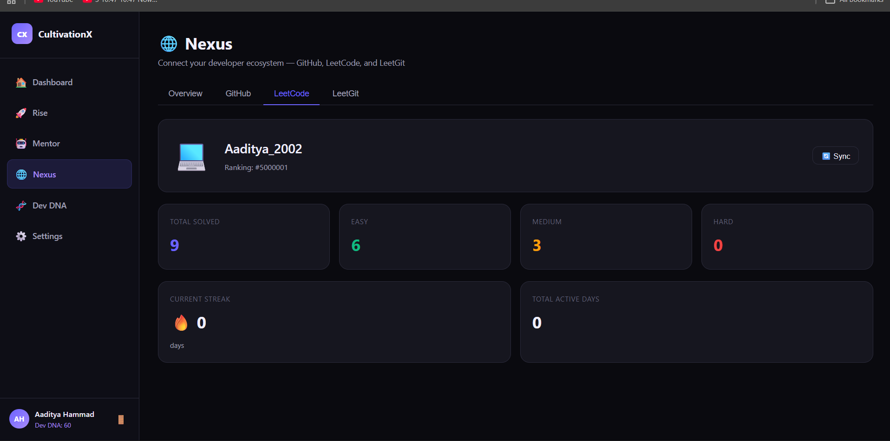
  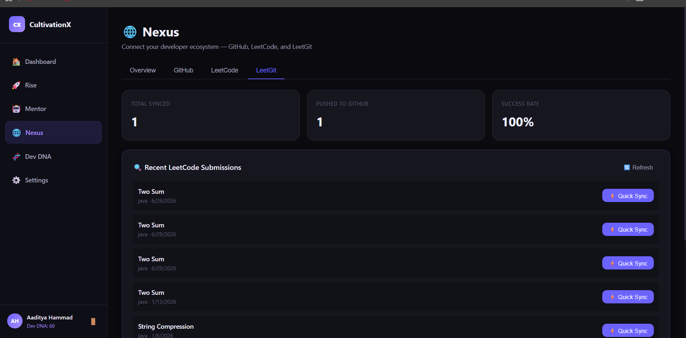
  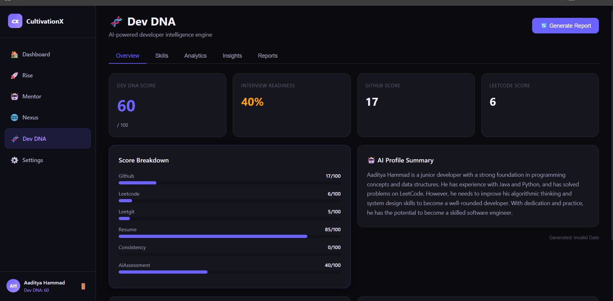
</p>

<p align="center">
  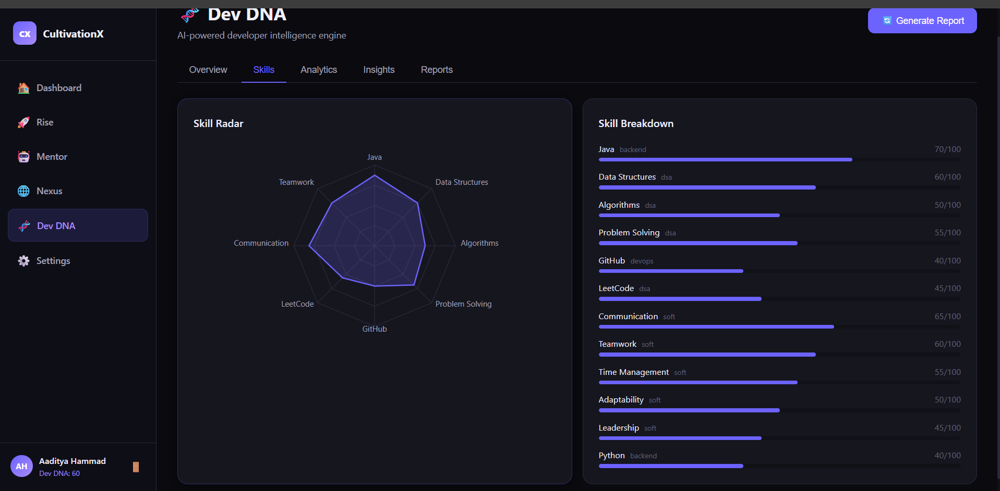
  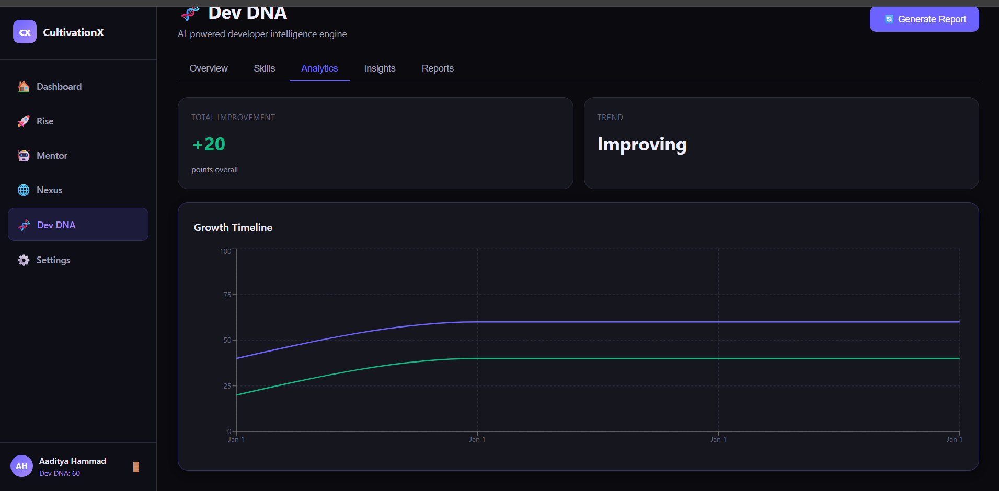
  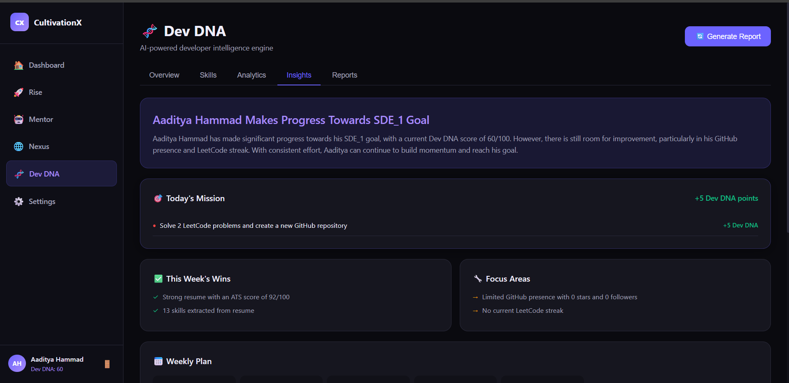
</p>

<p align="center">
  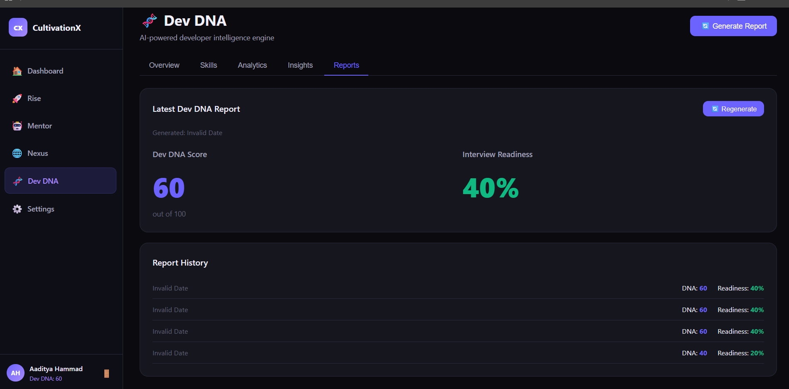
</p>

## Notes

- LeetGit+ sync is manual (LeetCode has no webhooks)
- LeetCode stats use a public proxy with occasional downtime
- Never commit `.env` or `application-local.yml`

---

## License

MIT
